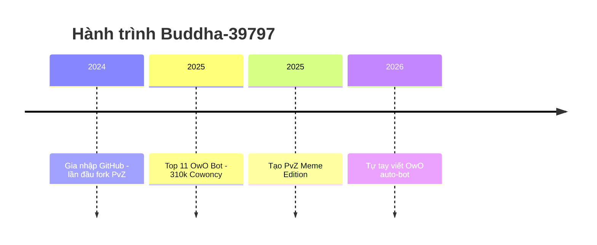

<h1 align="center">🚀 Buddha-39797 - Hành trình từ lớp 5 đến huyền thoại GitHub 🚀</h1>

<p align="center">
  
</p>


<p align="center">
  
  
</p>

---

## 🎮 Ai đây? Chính là mình nè!
- 🧠 11 tuổi, học lớp 5 – nhưng không phải "trẻ trâu code dạo" đâu nhé!
- 💻 Dân code PvZ chính hiệu, chuyên săn file `.dll`
- 🔧 Fork mọi repo PvZ nhìn thấy
- 🐄 310,432 Cowoncy – top 11 server "Hầm ngục tối tăm"  
- 🤖 Fan cuồng OwO Bot & code automation

---

## 📈 GitHub Stats của mình

<p align="center">
  
  
</p>

---

## 🔮 Tính cách qua badge

<p align="center">
  
  
</p>

---

## 🧠 Quote chất lượng

> “Trẻ em cũng có thể lập trình ra thế giới!” – *Buddha-39797*  
> “Mod PvZ là đam mê, còn git push là thở” – *Bro said that*

---

## 🔥 Dự án nổi bật

<table style="width:100%">
  <thead>
    <tr>
      <th>💾 <strong>Repo</strong></th>
      <th>🔥 <strong>Mô tả</strong></th>
      <th>🔗 <strong>Link</strong></th>
    </tr>
  </thead>
  <tbody>
    <tr>
      <td><strong>PVZRHCustomization</strong></td>
      <td>Thêm các Mod plants mới và được làm bởi <strong>Infinite75</strong>.</td>
      <td><a href="https://github.com/Buddha-39797/PVZRHCustomization">🔎 Xem ngay</a></td>
    </tr>
    <tr>
      <td><strong>PVZ-Menu-Cheat</strong></td>
      <td>Cheat cho PvZ Fusion: sửa bộ nhớ trò chơi để mở tính năng ẩn, viết bằng C++ bởi <strong>yurikia</strong>. 😝</td>
      <td><a href="https://github.com/Buddha-39797/PVZ-Menu-Cheat">🔎 Xem ngay</a></td>
    </tr>
    <tr>
      <td><strong>PVZRH-Tools</strong></td>
      <td>Tools hỗ trợ chơi PvZ Fusion dễ hơn, made by <strong>Infinite75</strong>.</td>
      <td><a href="https://github.com/Buddha-39797/PVZRH-Tools">🔎 Xem ngay</a></td>
    </tr>
    <tr>
      <td><strong>PvZRHModified</strong></td>
      <td>Mod menu giúp unlock nhiều thứ hay ho trong PvZRH Fusion, code bởi <strong>LibraHp</strong>. 🤩</td>
      <td><a href="https://github.com/Buddha-39797/PvZRHModified">🔎 Xem ngay</a></td>
    </tr>
    <tr>
      <td><strong>PvZRH-Fusion-Plants-Zombies-And-Hammers-Fanmade</strong></td>
      <td>Tổng hợp các plants, zombies và búa fanmade cực chất được các Dev phát triển và được Buddha-39797 chọn lọc cho PvZRH Fusion.</td>
      <td>🔒 <strong>Coming soon...</strong> 🧠<br><sub><i>Project đang được Buddha ủ mưu cực mạnh 😤</i></sub></td>
    </tr>
  </tbody>
</table>

---

## 🛠 Công cụ yêu thích

<p align="center">
  
  
  
  
</p>

---

## 🧪 Skill tree của mình (dạng game 🎮)

```
💡 Lập trình Cơ bản: ███████░░░░░ 70%
🌿 PvZ Modding:      ██████████░ 95%
⚙️ Git/GitHub:        ██████░░░░░ 60%
🧩 Meme Power:        ██████████ 100%
🎨 Sáng tạo Markdown: ████████░░░ 80%
```

---

## ⌛ Timeline hành trình



---

## 🎨 Fan art yêu thích

<p align="center">
  
  
</p>

---

## 📬 Liên hệ

<p align="center">
  <a href="https://discord.gg/tdqznfah3s"></a>
  <a href="mailto:nguyenminhhuykt2014@gmail.com"></a>
</p>

---

<p align="center">
  
</p>

<p align="center"><b>🌟 Cảm ơn bạn đã xem đến đây! Đừng quên thả sao ⭐ nếu bạn thích nha!</b></p>
