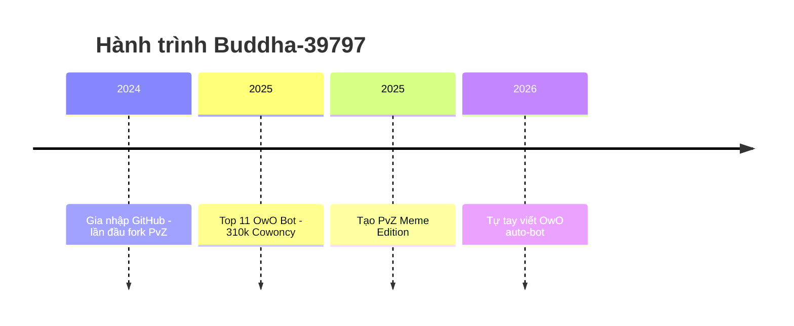

<h1 align="center">🚀 Buddha-39797 - Hành trình từ lớp 6 đến huyền thoại của GitHub 🚀</h1>
<p align="center">
  
</p>

<p align="center">
  
  
  
</p>
<p align="center">
  
</p>
<p align="center">
  
  
</p>


## 🎮 Ai đây? Chính là mình nè!
- 🧠 12 tuổi, học lớp 6 – nhưng không phải "trẻ trâu code dạo" đâu nhé!
- 💻 Dân code PvZ chính hiệu, chuyên săn file `.dll`
- 🔧 Fork mọi repo PvZ nhìn thấy
- 🐄 702,849 Cowoncy – top 5 server "Hầm ngục tối tăm"  
- 🤖 Fan cuồng OwO Bot & code automation
- ⚽ Fan cuồng cầu thủ nổi tiếng nhất thế giới: Cristiano Ronaldo

---

## 📈 GitHub Stats của mình

<p align="center">
  
  
</p>
<p align="center">

---

## 🔮 Tính cách qua badge

<p align="center">
  
  
</p>

---

## 🧠 Quote chất lượng

> “Trẻ em cũng có thể lập trình ra thế giới!” – *Buddha-39797*  
> “Mod PvZ là đam mê, còn git push là thở” – *Bro said that*

---

## 🔥 Dự án nổi bật

<table style="width:100%">
  <thead>
    <tr>
      <th>💾 <strong>Repo</strong></th>
      <th>🔥 <strong>Mô tả</strong></th>
      <th>🔗 <strong>Link</strong></th>
    </tr>
  </thead>
  <tbody>
    <tr>
      <td><strong>readme-typing-svg</strong></td>
      <td>Nó là một Repository về typing svg và được làm bởi <strong>DenverCoder1</strong>.</td>
      <td><a href="https://github.com/Buddha-39797/readme-typing-svg">🔎 Xem ngay</a></td>
    </tr>
    <tr>
      <td><strong>Buddha-39797</strong></td>
      <td><p align="center">⚡ Repo gốc gác của huyền thoại <strong>PvZ</strong>.
          <p align="center">🧠 Mỗi commit = 1% IQ tăng!
          <p align="center">💾 Fork là đam mê, bug là bạn thân 😎.</td>
      <td><a href="https://github.com/Buddha-39797/Buddha-39797">🔎 Xem ngay</a></td>
      <tr>
      <td><strong>GimkitCheat</strong></td>
      <td>Nó là một Repository về <strong>Gimkit</strong>, giúp bạn có thể dễ dàng để chiến thắng mọi người và được làm bởi <strong>The Lazy Squid</strong>.</td>
      <td><a href="https://github.com/Buddha-39797/GimkitCheat">🔎 Xem ngay</a></td>
        </tr>
       <tr>
        <td><strong>GimkitSpawner</strong></td>
      <td>Nó là một Repository về <strong>Gimkit</strong>, giúp bạn có thể cho rất nhiều bot <strong>( LÀ BOT, KHÔNG PHẢI NGƯỜI CHƠI THẬT SỰ )</strong>, nó sẽ gây lag cho server đó và được làm bởi <strong>The Lazy Squid</strong>.</td>
      <td><a href="https://github.com/Buddha-39797/GimkitSpawner">🔎 Xem ngay</a></td>
         </tr>
       <tr>
        <td><strong>QuizletLiveCheat</strong></td>
      <td>Nó là một Repository về <strong>Quizlet</strong>, giúp bạn có thể chiến thắng Quizlet Live một cách dễ dàng và giành Top 1 rất dễ và được làm bởi <strong>The Lazy Squid</strong>.</td>
      <td><a href="https://github.com/Buddha-39797/QuizletLiveCheat">🔎 Xem ngay</a></td>
    </tr>
    <tr>
  </tbody>
</table>

---

## 🛠 Công cụ yêu thích

<p align="center">
  
  
  
  
</p>

---

## 🧪 Skill tree của mình (dạng game 🎮)

```
💡 Lập trình Cơ bản: ███████░░░░░ 70%
🌿 PvZ Modding:      ██████████░ 95%
⚙️ Git/GitHub:        ██████░░░░░ 60%
🧩 Meme Power:        ██████████ 100%
🎨 Sáng tạo Markdown: ████████░░░ 80%
```

---

## ⌛ Timeline hành trình



---

## 🎨 Fan art yêu thích

<p align="center">
  
  
</p>
<!-- Hai hình đầu căn giữa, cùng kích thước -->
<p align="center">
  
  
</p>
<p align="center">
  <i>🔧 Tui chỉ mod nhẹ thôi mà... 💥 | Commit 176 là lúc tui đạt cảnh giới!</i>
</p>

<!-- Hình thứ ba cũng ở giữa và cùng kích thước -->
<p align="center">
  
  <br/>
  <i>🌟 Một follow thôi cũng làm tim tui đập mạnh hơn (thật đó 😳)</i>
</p>

---

## 📬 Liên hệ

<p align="center">
  <a href="https://discord.gg/tdqznfah3s"></a>
  <a href="mailto:nguyenminhhuykt2014@gmail.com"></a>
</p>

---

<p align="center"><b>🌟 Cảm ơn bạn đã xem đến đây! Đừng quên thả sao ⭐ nếu bạn thích nha!</b></p>

<p align="center">
<a href="https://github.com/Buddha-39797">
    
  
</p>
